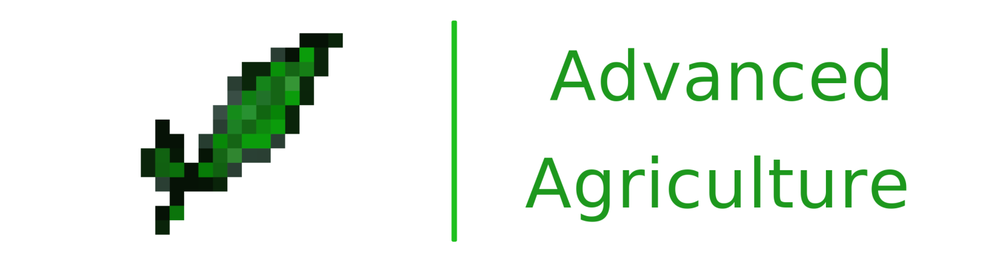

<h1 align="center"> 高级农业-核心 | Advanced_Agriculture-core </h1>



<h2 align="center"> 一个旨在拓展 Minecraft 原版与农业相关的体验的模组 </h2>

<h3 align="center">构建状态以及项目信息</br> </h3>

<div align="center">
     
     
     
</div>

### 特别感谢

- Fabric Team
- All the contributors no matter translator or programmer or painter and so on
- All the developer and who love this mod

### 注意!

当您使用本模组时, 即代表您已阅读[用户须知](assets/markdowns/UserNoticeCN.md)

---

## 当前状态

截至 2021 年 8 月 3 日，本项目仍然处于开发状态，没有产生任何可以用于游玩的版本。

## 开发进度

- [x] Dev
- [ ] Alpha
- [ ] Beta
- [ ] 正式版

可以通过查看 _[项目看板](https://github.com/MysteriousStudio/AdvancedAgriculture-core/projects/1)_ 来查看具体的开发进度与我们的工作

版本命名规则请移步 [](assets/markdowns/VersionName.md)

## 如何构建

### 手动构建

```shell
gradle build
```

在工作完成后，最终的构建结果会出现在`./build/libs/`中。

## 作出贡献

您可以通过以下的方法为模组进行贡献：

- 为模组仓库提 PR
- 为模组编写 Wiki
- 为模组进行一定程度的推广
- 为模组的多语言进行贡献
- 为模组所需求的模型，材质等进行设计
- 为我们资助一些经费
- 成为模组开发者的一员
- 提出合理的issues

---

## 资助我们，让我们有外在动力持续开发

到目前为止，高级农业-核心的开发者，材质画师，建模，策划全部为学生或者无工作身份，利用业余时间进行开发。

您的一份资助能减轻我们的财政负担，或是服务器开销，软件的开销，或者是买一杯奶茶，饮料喝。

### 资助方案：

- [爱发电](https://afdian.net/@AdvAgri_Core)
